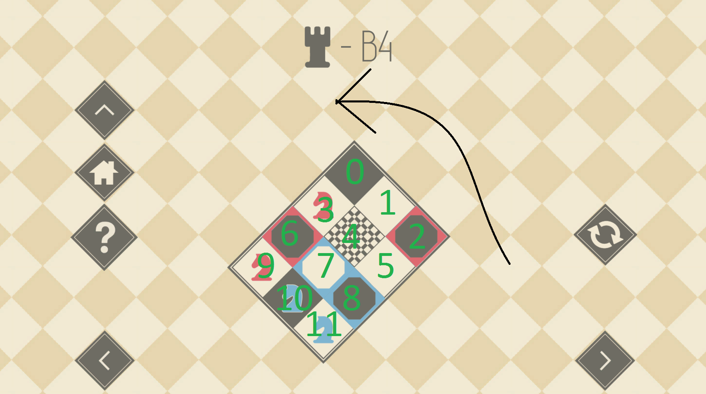
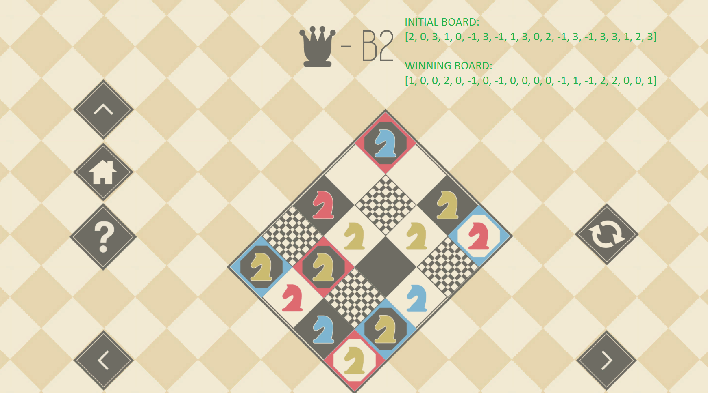
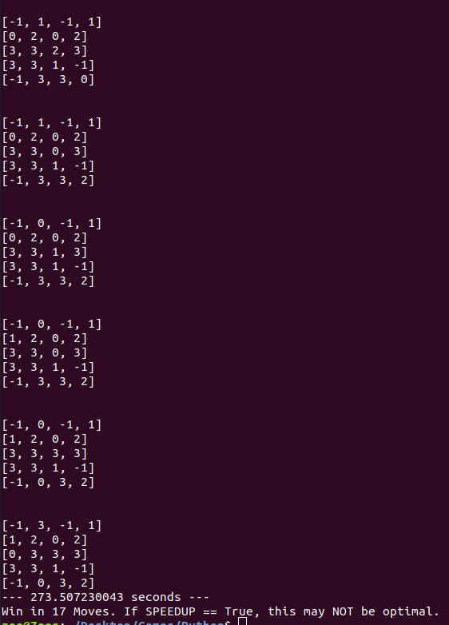
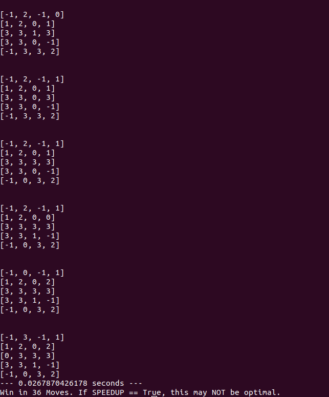

# Knights-Game
#### [Steam Link](https://store.steampowered.com/app/476240/KNIGHTS/)

---

Python written BFS with heuristic for higher levels.

Works:

    In the Chess.py File change INITIAL_BORD & WINNING_BOARD accordingly.
    Set SPEEDUP False / True.
    Run.
    
    
SPEEDUP == True will usually solve the Game way faster, uses out of place heuristic. 

SPEEDUP_EXP == True will use a non-admissible heuristic, solves 5x5-boards usually within seconds or less, but may be non-optimal.

SPEEDUP == SPEEDUP_EXP == False will solve the Game optimal, but will take longer (without heuristic).

For King levels (5x5) SPEEDUP == False will mostly consume too much memory, to be solvable, SPEEDUP == True or better: SPEEDUP_EXP == True will do the job.

---

SETTINGS:

Figures:

      Empty: 0      
      Not Moveable: -1
      Red: 1
      Blue: 2
      Golden: 3

Board is numerated in this fashion:

  

Setting BOARDS:

IMPORTANT!:

Goldens (3's) are set to 0 in the WINNING_BOARD!! As you can see in this Picture:

---

Example:

Output with SPEEDUP == False:

Output with SPEEDUP_EXP == True:

False returns the optimum, True a suboptimal solution, but way faster. Time depends on the machine.

The 3x3, 4x3, 4x4 boards are usually solved < 1 sec. (SPEEDUP == False and SPEEDUP_EXP == False)

The 5x4 boards can take several  minutes. (SPEEDUP == False and SPEEDUP_EXP == False)

The 5x5 boards mostly won't be solved without SPEEDUP == True or SPEEDUP_EXP == True.

IMPORTANT!!::

Printed boards must be read from bottom to top.

Uses heapq module.
